# Azure Pipelines E2E example

Run the existing Playwright + Cucumber suite on an Azure DevOps Services
Microsoft-hosted Linux agent using [native-pipeline.yml](native-pipeline.yml).
The API, Angular, SQLite, and Chromium run directly on the agent, without Docker.
The pipeline installs Node.js 22, Python 3.12, npm dependencies, and Playwright
Chromium with its Linux libraries.

This example runs E2E tests only. Angular unit tests, backend pytest, and the
launcher unit tests are separate suites; see the [QA commands](../README.md#qa).

## Register and launch a pipeline

1. Push the repository, including `azure/`, to a repository supported by Azure
   Pipelines, such as Azure Repos Git or GitHub.
2. In your Azure DevOps project, open **Pipelines > New pipeline**, select the
   repository provider, and authorize repository access when prompted.
3. Select **Existing Azure Pipelines YAML file**, choose your branch, and set
  the path to `/azure/native-pipeline.yml`.
4. Save the pipeline. Open **Run pipeline**, select the branch and parameters,
  and start the run.
5. Follow the job logs, then open the run's **Tests** tab and download its report
   artifact from the run summary.

Your organization must have Microsoft-hosted agent capacity and permission to
run pipelines. New organizations may need to request a hosted parallel-job grant
or purchase capacity. Dependency installation requires outbound network access.
The job has a 30-minute timeout.

No Azure subscription, Azure Resource Manager service connection, container
registry, or cloud deployment credentials are needed. The repository connection
and Azure DevOps hosted-agent access are sufficient. This YAML file targets
Azure DevOps Services; Azure DevOps Server needs a suitable self-hosted agent
and a supported artifact publishing task instead of `PublishPipelineArtifact@1`.

## Run options

| Parameter | Default | Examples |
| --- | --- | --- |
| `environment` | `dev` | `dev` or `prod` selects the local SQLite database inside the job. |
| `tags` | `all` | `all` runs the full suite; `@smoke`, `@DEMO-2`, or `@validation and not @api` filters scenarios. |
| `viewport` | `desktop` | `desktop` or `mobile` (390 x 844). |

Enter tag expressions without surrounding shell quotes in **Run pipeline**.
Parameters are passed through environment variables and quoted Bash arrays, so
spaces and parentheses remain part of a single Cucumber argument. Runs are
headless, with no interactive desktop required.

The native job executes:

```bash
npm ci --no-audit --no-fund
npx playwright install --with-deps chromium
npm run test:e2e -- --env dev
```

## Dynamic environment lifecycle

Each job gets a fresh hosted VM and checkout. The application is created on
demand for the tests; there is no permanent test server to provision manually.

```mermaid
flowchart LR
    A[Fresh hosted agent and checkout] --> B[Install runtimes and dependencies]
    B --> C[Create SQLite and apply Alembic migrations]
    C --> D[Start API and Angular on available ports]
    D --> E[Wait for readiness and run Cucumber with Chromium]
    E --> F[Stop owned servers]
    F --> G[Publish JUnit results and report artifacts]
    G --> H[Hosted agent discarded]
```



The existing launcher chooses available ports, wires the Angular `/api` proxy,
and waits for both servers before launching tests. The browser and servers use
agent-local loopback URLs. The pipeline does not expose a public demo
URL, and URLs printed in pipeline logs are not reachable from your laptop.

The launcher creates `.local/<environment>/proposals.db` and applies migrations
before every run. Successful scenarios retain synthetic records during the job.
Reports are written to `e2e/reports/` in the agent workspace and published after
the test command finishes. Neither the database nor runtime directories
are published or cached; the hosted VM is discarded after the job. Local runs
on your own computer still retain their databases as documented elsewhere.

`dev` and `prod` are local demo labels, not Azure deployment environments.
Even `prod` here uses a fresh job-local SQLite database, not a live production
service. The example does not create Azure Container Apps, App Service, Azure
SQL, or Azure DevOps Environment resources. A public per-PR review deployment
would need separate provisioning, credentials, a remote-testing contract, and
resource teardown; it is outside this agent-local example.

The runner stops its owned servers on success, failure, and handled
SIGINT/SIGTERM. Test failures keep the job failed. Reporting tasks use
`always()` so ordinary test failures still publish results; missing JUnit output
also fails publication instead of appearing as a successful run with no tests.
A forcibly terminated agent or cancellation before reports exist can prevent
artifact publication, but the hosted VM remains disposable.

## Results and troubleshooting

- **Tests tab:** `junit.xml` supplies scenario pass/fail results to Azure Pipelines.
- **Report artifact:** `index.html`, `cucumber.html`, `cucumber.json`, `junit.xml`,
  and any failure screenshots or Playwright trace ZIPs are published together.
  Download and extract the entire artifact, then open `index.html` locally;
  keep it alongside `cucumber.html`.
- **Failure traces:** inspect a downloaded trace with
  `npx playwright show-trace <path-to-trace.zip>` from a machine with Playwright.
- **Startup failures:** check dependency-install, migration, and readiness logs.
  No JUnit report is expected if Cucumber never started. An artifact directory
  is prepared early, but may be empty when setup fails.
- **Queued jobs:** check the organization's hosted parallel-job capacity.

Artifacts follow your Azure DevOps retention policy and access controls. Use
synthetic data only: screenshots, traces, and reports can contain request data.
Multiple jobs must not share a checkout/report directory on self-hosted agents;
the fresh hosted agents used here keep concurrent runs isolated.

## Optional automatic runs

The pipeline deliberately uses `trigger: none` and `pr: none` for manual demos.
To enable pushes to `main`, replace the `trigger` entry:

```yaml
trigger:
  branches:
    include:
      - main
```

For GitHub repositories, replace `pr: none` with the following to validate PRs
targeting `main`:

```yaml
pr:
  branches:
    include:
      - main
```

For Azure Repos Git, YAML `pr` triggers are not supported. Configure a **Build
validation** branch policy for `main` and select the registered pipeline instead.
Automatic runs use the parameter defaults. The example does not deploy resources
or need a teardown stage for an Azure subscription.